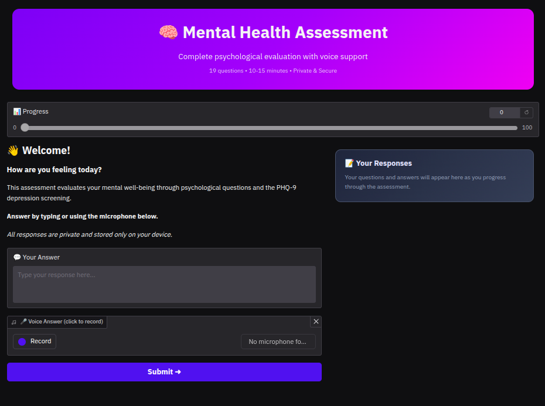
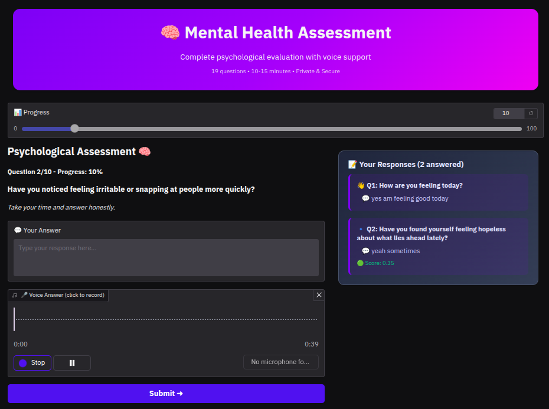
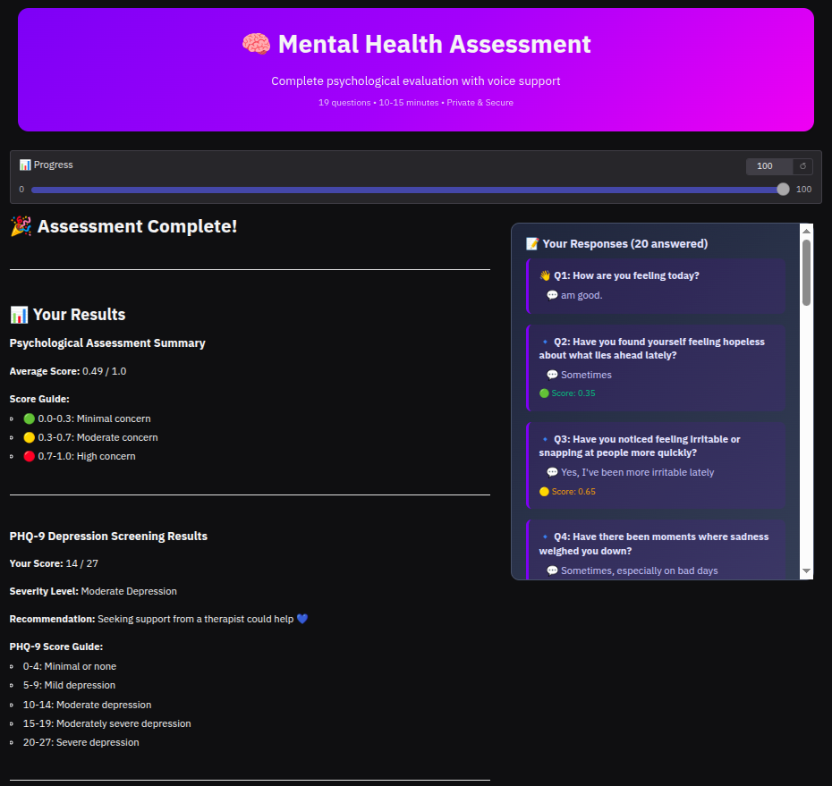
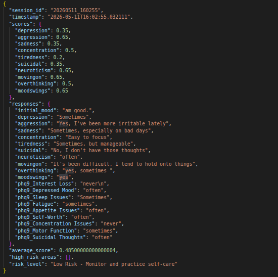

# 🧠 AI Mental Health Assessment System

AI-powered psychological screening tool using **Llama 3.2-3B** and **Whisper AI** for intelligent mental health evaluation.


## Features

- **Smart AI Analysis** - Llama 3B understands and scores psychological responses
- **Voice Enabled** - Speak your answers using Whisper speech recognition
- **10 Mental Health Metrics** - Depression, anxiety, stress, concentration, and more
- **PHQ-9 Screening** - Standardized clinical depression assessment
- **Beautiful Interface** - Modern dark theme with real-time progress tracking
- **Complete Privacy** - All data stored locally on your device

## Quick Start

```bash
# Install dependencies
pip install -r requirements.txt

# Download Llama model (one-time setup)
# Place model files in the same directory as mental_health_complete.py

# Run application
python mental_health_complete.py
```

The web interface opens automatically at `http://localhost:7860`

## Screenshots

| Welcome Screen                    | Assessment in Progress                |
| --------------------------------- | ------------------------------------- |
|  |  |

| Conversation History              | Results Dashboard                 |
| --------------------------------- | --------------------------------- |
|  |  |

## Technology Stack

- **Language Model**: Llama 3.2-3B-Instruct (Meta)
- **Speech Recognition**: Whisper Tiny (OpenAI)
- **Framework**: LangChain, PyTorch, Transformers
- **Interface**: Gradio
- **Audio**: SoundDevice, SoundFile, pyttsx3

## How It Works

The system conducts a ten to fifteen minute psychological interview evaluating ten key mental health dimensions. Each response is analyzed by the Llama language model which understands context, emotional language, and severity indicators. Scores range from zero to one with color-coded feedback: green for minimal concern, yellow for moderate, red for high concern. The assessment concludes with standardized PHQ-9 depression screening and generates a comprehensive report saved locally.

## Requirements

- Python 3.8+
- 8GB RAM (16GB recommended)
- GPU optional (NVIDIA 4GB+ for faster processing)
- 10GB disk space for Llama model

## Important Notes

This is a screening tool for educational and research purposes, not a medical diagnostic instrument. Results should be discussed with qualified mental health professionals. If experiencing crisis, contact emergency services immediately.

## Privacy

All assessment data remains on your local device. No external transmissions. Complete privacy guaranteed.

## License

Educational and research use. For clinical deployment, ensure appropriate validation and oversight.

---
